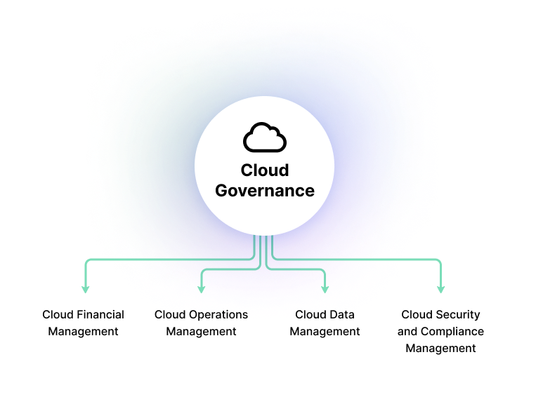

# Governance & Policies

## 1. Was versteht man unter „Governance & Policies“?

**Governance** beschreibt im IT-Kontext den übergeordneten Rahmen aus Regeln, Prozessen und Verantwortlichkeiten, der sicherstellt, dass IT-Systeme und -Ressourcen im Einklang mit den strategischen Zielen eines Unternehmens genutzt werden.

**Policies** (Richtlinien) sind konkrete Handlungsanweisungen, die innerhalb dieses Rahmens formuliert werden. Sie legen fest, **was erlaubt ist**, **was verpflichtend ist** und **wer wofür verantwortlich ist**.

> **Zusammenhang:** Governance schafft den Rahmen – Policies setzen ihn operativ um.

---

## 2. Kontext der Verwendung

Governance & Policies finden Anwendung in vielen Bereichen der IT:

- **Cloud-Computing** (z. B. Zugriffskontrolle in AWS oder Azure)
- **Informationssicherheit** (z. B. Passwortrichtlinien, Datenklassifikation)
- **Compliance & Datenschutz** (z. B. Umsetzung der DSGVO oder ISO 27001)
- **IT-Service-Management** (nach ITIL, COBIT)
- **Corporate IT-Governance** (z. B. GRC: Governance, Risk & Compliance)

In komplexen IT-Landschaften sind sie unverzichtbar, um **Verantwortlichkeiten zu definieren**, **Risiken zu minimieren**, **Betriebsstandards zu etablieren** und **Audits zu bestehen**.

---

## 3. Technische Funktionsweise

Ein Governance-Framework wird durch folgende Elemente umgesetzt:

- **Rollen & Zuständigkeiten**  
  z. B. wer ist Data Owner, wer ist Systemverantwortlicher

- **Policies & Standards**  
  z. B. Passwort-Policy, Verschlüsselungspflicht, Bring-Your-Own-Device-Richtlinien

- **Kontrollmechanismen & Monitoring**  
  z. B. automatisierte Policy Checks, Security Audits, Logging

- **Tool-Unterstützung**  
  z. B. Azure Policy, AWS Organizations, GRC-Tools wie ServiceNow oder SAP GRC

---

## 4. Gängige Protokolle, Tools & Produkte

| Bereich               | Beispiele                                                        |
|-----------------------|------------------------------------------------------------------|
| **Cloud Governance**  | Azure Policy, AWS Organizations, Google Organization Policies    |
| **Security & Audit**  | ISO/IEC 27001, NIST SP 800-53, CIS Controls                      |
| **Compliance**        | DSGVO (EU), HIPAA (USA), BaFin (DE)                              |
| **GRC-Tools**         | ServiceNow GRC, SAP GRC, RSA Archer                              |
| **ITSM & Frameworks** | ITIL 4, COBIT 2019, TOGAF                                        |

---

## 5. Architektur / Visualisierung

Hier eine vereinfachte Darstellung einer IT-Governance-Struktur in einem Cloud-Umfeld:

 
Quelle: Imperva – https://www.imperva.com/learn/data-security/cloud-governance/ 

---

## 6. Fazit

Governance & Policies sind elementar für den sicheren und effizienten Betrieb moderner IT-Infrastrukturen. Sie strukturieren Verantwortlichkeiten, reduzieren Risiken und sorgen für Regelkonformität (Compliance). Besonders in Cloud-Umgebungen und bei sensiblen Daten bilden sie die Grundlage für nachhaltige und auditierbare IT-Prozesse.

---

## 7. Quellen

1. Microsoft Learn – [Cloud Adoption Framework](https://learn.microsoft.com/en-us/azure/cloud-adoption-framework/govern/)
2. Microsoft Learn – [Azure Policy Overview](https://learn.microsoft.com/en-us/azure/governance/policy/overview)
3. AWS – [What is AWS Organizations?](https://docs.aws.amazon.com/organizations/latest/userguide/orgs_introduction.html)
4. ISO – [ISO/IEC 27001 Information Security Management](https://www.iso.org/isoiec-27001-information-security.html)
5. NIST – [Security and Privacy Controls for Information Systems](https://csrc.nist.gov/publications/detail/sp/800-53/rev-5/final)
