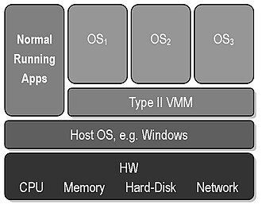

# Thema: Type 1 Hypervisor

## Inhaltsverzeichnis

1. [Was ist ein Hypervisor?](#was-ist-ein-hypervisor)
2. [Wie funktioniert ein Hypervisor?](#wie-funktioniert-ein-hypervisor)
3. [Welche Arten von Hypervisoren gibt es?](#welche-arten-von-hypervisoren-gibt-es)
4. [Quellen](#quellen)

## Was ist ein Hypervisor?

Hypervisor, auch bekannt als Virtual-Machine-Monitor oder VMM, sind Software, mit welcher die Ressourcen einer physischen Maschine zusammengefasst und verteilt werden können.  
Das Zusammenfassen und Verteilen von Ressourcen ermöglicht das Virtualisieren, wodurch **virtuelle Maschinen (VMs)** erstellt und benutzt werden können.  

Der Name Virtual-Machine-Monitor leitet sich davon ab, dass der Hypervisor die Verteilung der Ressourcen "überwacht" - also auf Englisch **Monitoring** betreibt.  
Auch der Name Hypervisor leitet sich von einem ähnlichen Wortstamm ab. "Hyper" aus dem Griechischen bedeutet "über", während Visor vom Lateinischen "videre" kommt, was "sehen" bedeutet.  
Zusammengesetzt ergibt sich daraus wieder etwas wie ein Aufseher.  

Die physische Maschine, auf welcher der Hypervisor läuft, ist der Host - die virtuellen Maschinen werden Guests genannt.

## Wie funktioniert ein Hypervisor?

Ein Hypervisor verwaltet lediglich den Zugriff auf die Hardwareressourcen. Angeforderte Rechenleistungen und Aufgaben werden dadurch an die Host-Hardware weitergeleitet und je nach Verfügbarkeit ausgeführt.  
Während auf einem Hostsystem ohne Virtualisierung nur ein Betriebssystem zur selben Zeit laufen kann, kann durch Virtualisierung die vorhandene Hardware auf mehrere Maschinen aufgeteilt werden.  
Dies ermöglicht das gleichzeitige Betreiben mehrerer Betriebssysteme auf einer physischen Maschine.

## Welche Arten von Hypervisoren gibt es?

Bei Hypervisoren wird zwischen Typ-1 und Typ-2-Hypervisoren unterschieden. Während beide Typen die Hardwareressourcen auf virtuelle Maschinen aufteilen, unterscheiden sie sich in ihrer Funktionsweise.

### Typ-1-Hypervisor

Hypervisoren von Typ 1 werden auch **native** oder **bare-metal** genannt, da sie direkt auf der Host-Hardware laufen

Dieses Bild stellt die Funktionsweise eines Typ-1-Hypervisors dar - die Hypervisor Software liegt direkt auf der Host-Hardware und auf dem Hypervisor laufen Gast VMs.  
Ein Typ-1-Hypervisor ersetzt das Hostbetriebssystem und verwaltet die Ressourcen der Host-Hardware direkt.

Der Vorteil von Typ-1-Hypervisoren ist, dass auf der Hardware kein Betriebssystem installiert werden muss, sondern der Hypervisor direkt darauf läuft.  
Der Nachteil ist jedoch, dass die Hardware des Hostsystems vom Hypervisor durch passende Treiber unterstützt werden muss.

Typ-1-Hypervisoren finden großteils in der Unternehmenswelt anwendung, wo VMs direkt auf Servern laufen und verwaltet werden.

### Typ-2-Hypervisor

Hypervisoren vom Typ 2 werden auch **hosted** genannt, da sie auf dem Hostbetriebssystem laufen.

In diesem Bild wird die Funktionsweise eines Typ-2-Hypervisors dargestellt. Hier läuft die Software des Hypervisors auf dem Hostbetriebssystem, wodurch neben dem Hypervisor noch andere Apps betrieben werden können.  

Der Vorteil dieser Virtualisierungsart ist, dass die Hypervisor-Software auf jeder Maschine läuft, auf welcher ein kompatibles Hostbetriebssystem betrieben werden kann. Somit wird der Betrieb auf unteschiedlicher Hardware erleichtert.  
Ein weiterer Vorteil ist die Möglichkeit, neben Gast VMs weitere Anwendungen laufen zu lassen.
Ein Nachteil von Typ-2-Hypervisoren ist die geringere Leistung auf gleicher Hardware aufgrund des Betriebssystems, welches selbst Rechenleistung benötigt.

### Vergleich der 2 Arten

|               |        **Typ-1-Hypervisor**         |           **Typ-2-Hypervisor**           |
|:--------------|:-----------------------------------:|:----------------------------------------:|
| Bekannt als   |          native/bare-metal          |                  hosted                  |
| Läuft auf     |            Host-Hardware            |           Host-Betriebssystem            |
| Geeignet für  |    Große Anwendungen/Unternehmen    |    Kleine Anwendungen/Einzelpersonen     |
| Komplexität   |    Gute Kenntnisse erforderlich     |      Wenig Kenntnisse erforderlich       |
| Beispiele     | Microsoft Hyper-V, KVM, VMware ESXi | Oracle VM Virtualbox, VMware Workstation |

## Quellen

- [Wikipedia](https://de.wikipedia.org/wiki/Hypervisor)
- [Redhat](https://www.redhat.com/de/topics/virtualization/what-is-a-hypervisor)
- [AWS](https://aws.amazon.com/de/compare/the-difference-between-type-1-and-type-2-hypervisors/)
- [techtarget](https://www.techtarget.com/searchitoperations/tip/Whats-the-difference-between-Type-1-vs-Type-2-hypervisor)