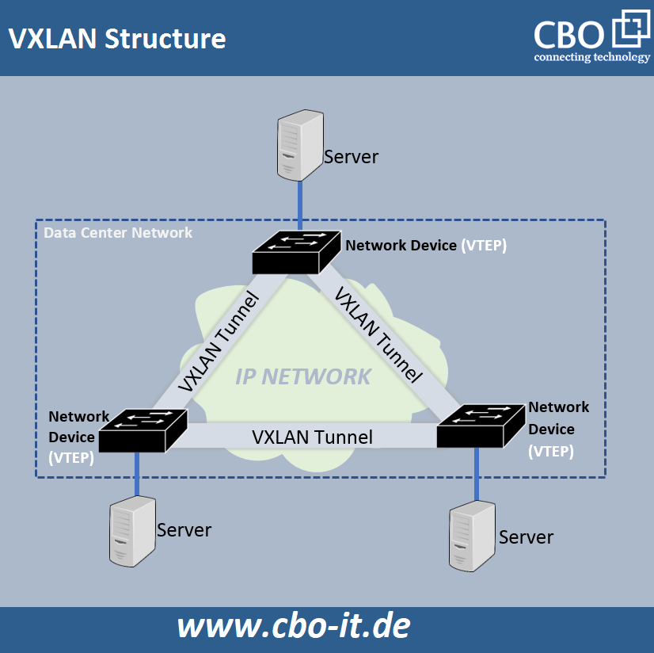

# 1. Einführung: Was ist VXLAN?

Als VXLAN bezeichnet man ein von der IETF standardisiertes Overlay-Protokoll, welches dazu dient, mehrere Organisationen bzw. Mandanten in einem physischen Netzwerk voneinander zu isolieren. Es kann somit niemand den Netzwerkdatenverkehr des jeweils anderen sehen, obwohl sie sich physisch im selben Netzwerk befinden.

Dies kann man mit einem Wohnhaus veranschaulichen, in dem einzelne, private Wohnungen sind, die jedoch in einer gemeinsamen physischen Struktur existieren. Genau so ist jedes VXLAN ein separates, privates Netzwerksegment innerhalb einer gemeinsamen physischen Struktur.

VXLAN ermöglicht ein gemeinsames physisches Netzwerk in über 16 Millionen einzelne virtuelle oder logische Netzwerke zu segmentieren. Ermöglicht wird das, indem Layer-2-Frames in ein Layer-4-UDP-Paket gekapselt und mit einem VXLAN-Header ausgestattet werden. Somit ermöglicht VXLAN die Erweiterung von Layer-2-Netzwerken über ein Layer-3-IP oder MPLS-Netzwerk.

# 2. Kontext und Einsatzgebiete

Durch die Bereitstellung von über 16 Millionen VXLAN-Layer-2-Netzwerken ist es möglich, sehr große Ethernet-Installationen zu realisieren. Dies ist vor allem für Betreiber großer virtueller Netzwerke und Cloud-Computing-Umgebungen wichtig, da sie ohne VXLAN in ihrer Netzwerkskalierung stark eingeschränkt wären.

Zudem erleichtert VXLAN den Transport von virtuellen Maschinen über Rechenzentren hinweg und verbessert die Skalierbarkeit in großen Netzwerkstrukturen durch das Trennen von Layer-2-Domänen über ein Layer-3-Netzwerk.

Außerdem gibt es zahlreiche rechtliche, datenschutzrechtliche und ethische Gründe, welche es notwendig machen, den Netzwerkverkehr verschiedener Kunden (Tenants) voneinander getrennt zu halten.

# 3. Technische Funktionsweise

Technisch gesehen kapselt VXLAN Layer-2-Ethernet-Frames in Layer-4-UDP-Pakete ein, um somit Layer-2-Netze über Layer-3-Infrastrukturen hinweg bereitstellen zu können. Dabei wird jedes virtuelle Subnetz durch einen VXLAN Network Identifier (VNI) eindeutig identifiziert.

Das Kapseln und Entkapseln erfolgt durch sogenannte VXLAN Tunnel Endpoints (VTEPs), welche entweder als physische Netzwerkgeräte oder als virtuelle Switches auf Hypervisoren implementiert sein können. Durch VTEPs wird die Kommunikation zwischen Endgeräten über ein IP-Netzwerk hinweg ermöglicht.

Um auch Geräte zu unterstützen, die nicht selbst als VTEP agieren können – wie z. B. Bare-Metal-Server – können Hardware-VTEPs (z. B. Switches oder Router) die Kapselung und Entkapselung übernehmen. Darüber hinaus können auch VTEPs in Hypervisor-Hosts eingesetzt werden, um virtualisierte Workloads direkt zu unterstützen. Hierbei spricht man von Software-VTEPs.

# 4. Protokolle, Tools und Produkte

## Protokolle

- VXLAN (RFC 7348): Kapselt Layer-2-Frames in UDP/IP. Verwendet UDP-Port 4789.

- EVPN (RFC 7432): BGP-basiertes Control-Plane-Protokoll für skalierbares MAC-Learning und VTEP-Erkennung.

- IGMP/PIM: Optional für Multicast-basierte VXLAN-Kommunikation.

## Software & Tools

- Open vSwitch (OVS): Open-Source-Switch mit VXLAN-Support, oft in KVM/OpenStack-Umgebungen.

- FRRouting (FRR): Routing-Stack mit BGP EVPN-Unterstützung.

- VMware NSX: Kommerzielle SDN-Lösung mit VXLAN, häufig in Enterprise-Clouds.

- Linux (ab Kernel 3.7): Native VXLAN-Unterstützung via iproute2.

## Hardware-Produkte

- Cisco Nexus, Arista, Juniper QFX: Switches mit nativer VXLAN- und EVPN-Unterstützung, geeignet für moderne Rechenzentrumsnetzwerke.

# 5. VXLAN-Architektur - Grafische Veranschaulichung

Auf der obigen Abbildung sieht man eine einfache grafische Veranschaulichung einer VXLAN-Architektur mit den jeweiligen VTEPs und Endgeräten (Server).

# 6. Vor- und Nachteile

## Vorteile:

- **Skalierbarkeit:**
VXLAN überwindet die Skalierungsprobleme herkömmlicher VLANs, die auf etwa 4094 Netzwerke begrenzt sind. VXLAN ermöglicht über 16 Millionen Netzwerksegmente. 

- **Flexibilität:**
VXLAN ermöglicht die flexible Platzierung von Multitenant-Segmenten im gesamten Rechenzentrum, was die Ressourcenauslastung optimiert. 

- **Effizienz:**
Nur Switches mit VTEPs (VXLAN Tunnel Endpoints) tragen eine zusätzliche Look-Up-Tabelle (LUT)-Last, was die Effizienz des Netzwerks erhöht. 

- **Lastausgleich und Redundanz:**
VXLAN unterstützt Lastausgleich und Redundanz durch die Nutzung von MP-BGP EVPN, was die Netzwerkzuverlässigkeit verbessert. 

- **Bessere Nutzung verfügbarer Pfade:**
VXLAN ermöglicht eine bessere Nutzung verfügbarer Netzwerkpfade, was die Effizienz des Netzwerks erhöht. 

- **Erweiterbarkeit:**
VXLAN kann auf bestehende Layer-3-Netzwerkinfrastrukturen aufsetzen, was die Implementierung vereinfacht. 

## Nachteile:

- **Komplexität:**
VXLAN kann komplex werden, insbesondere beim Umgang mit mehreren Segmenten und VTEPs. 

- **Kosten:**
Die Implementierung von VXLAN in Hardware ist teurer als herkömmliches Ethernet-Switching oder 802.1ad. 

# 7. Quellen

- https://www.juniper.net/de/de/research-topics/what-is-vxlan.html
- https://www.ip-insider.de/was-ist-vxlan-a-726595/
- https://www.cbo-it.de/shop/eine-einfuehrung-in-vxlan
- https://www.fibermall.com/de/blog/vxlan.htm#Q_What_are_some_common_use_cases_for_VXLAN
- https://www.cbtnuggets.com/blog/technology/networking/what-is-vxlan
- https://openvswitch.org
- https://frrouting.org
- https://vmware.com

