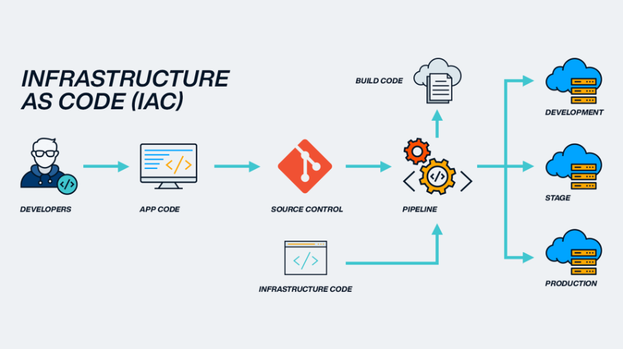

# Infrastructure as Code (IaC)

## 1. Einführung: Was ist Infrastructure as Code?

**Infrastructure as Code (IaC)** ist ein Ansatz zur automatisierten Verwaltung von IT-Infrastruktur mittels maschinenlesbarem Code.  
Statt Server, Netzwerke oder Datenbanken manuell über grafische Oberflächen einzurichten, wird die gesamte Infrastruktur in **Textdateien beschrieben**, versioniert und automatisiert ausgerollt.



---

## 2. Verwendungszusammenhang: Wann wird IaC eingesetzt?

IaC kommt überall dort zum Einsatz, wo Infrastruktur wiederholbar, konsistent und automatisiert bereitgestellt werden soll, insbesondere in:

- Cloud-Umgebungen (AWS, Azure, GCP)
- DevOps-Pipelines (CI/CD)
- Test-, Stage- und Produktionsumgebungen
- Container-Orchestrierung (z.B. Kubernetes mit Helm)
- Rechenzentren mit Infrastructure Automation

---

## 3. (Grobe) Technische Funktionsweise

IaC folgt der Idee: **„Infrastruktur wie Software behandeln“**.

### Typischer Ablauf:
1. Infrastrukturdefinition in YAML, JSON oder HCL
2. Verwaltung über Git
3. Automatisierte Ausführung mit Tools wie Terraform, Ansible, CloudFormation
4. Verteilung über Agenten oder APIs

Der Code ist wiederverwendbar, versionskontrolliert und auditierbar. Änderungen können geprüft, getestet und reproduziert werden, genau wie bei klassischem Code.

---

## 4. Gängige Tools, Produkte & Protokolle

### Deklarativ (beschreibt den Zielzustand):
- **Terraform** (HashiCorp)
- **AWS CloudFormation**
- **Azure Resource Manager (ARM) Templates**
- **Google Cloud Deployment Manager**

### Prozedural (schrittweise Anweisungen):
- **Ansible** (agentenlos, via SSH)
- **Chef** (mit Agenten)
- **Puppet** (modellbasiert)

---

## 5. Architektur (vereinfachtes Schaubild)

```plaintext
       Git Repository (IaC Code)
                  |
           CI/CD-Pipeline (z.B. GitHub Actions)
                  |
        +-----------------------+
        |      IaC Tool        |
        | (Terraform, Ansible) |
        +-----------------------+
                  |
       Cloud-Provider / Server-API
                  |
    Provisionierte Infrastruktur (VMs, Netzwerke, Storage)
```

--- 

## 6. Vorteile eines IaC-Ansatzes 

Konsistenz: identische Konfiguration in allen Umgebungen
Schnelligkeit: schneller Rollout neuer Umgebungen
Versionierung: Änderungen nachvollziehbar durch Git
Weniger Fehler: Automatisierung reduziert manuelle Eingriffe
Skalierbarkeit: Infrastruktur lässt sich schnell hoch- oder runterfahren
Wiederverwendbarkeit: Templates können mehrfach eingesetzt werden

---

## 7.  Nachteile / Herausforderungen

Komplexität: Einstieg erfordert Know-how und Einarbeitung
Fehlkonfigurationen: Ein Fehler im Code kann große Auswirkungen haben
Unterschiede zwischen Tools: Kein einheitlicher Standard
Debugging: Infrastrukturprobleme sind nicht immer leicht zu analysieren

---

## 8. Fazit

Infrastructure as Code revolutioniert den Umgang mit Infrastruktur.
Statt manueller Konfiguration entsteht eine automatisierbare, versionierte und nachvollziehbare Umgebung, die besonders in Cloud- und DevOps-Szenarien unverzichtbar ist.
Mit IaC können Organisationen schneller, sicherer und konsistenter Infrastruktur betreiben.

---

## Quellen:
- [Terraform – HashiCorp](https://developer.hashicorp.com/terraform) 
- [Red Hat: What is Infrastructure as Code (IaC)](https://www.redhat.com/en/topics/automation/what-is-infrastructure-as-code-iac) 
- [AWS: What is IaC](https://aws.amazon.com/what-is/iac/) 
- [Microsoft Learn: Infrastructure as Code](https://learn.microsoft.com/en-us/devops/deliver/what-is-infrastructure-as-code)


