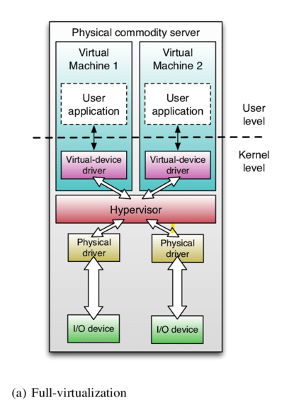
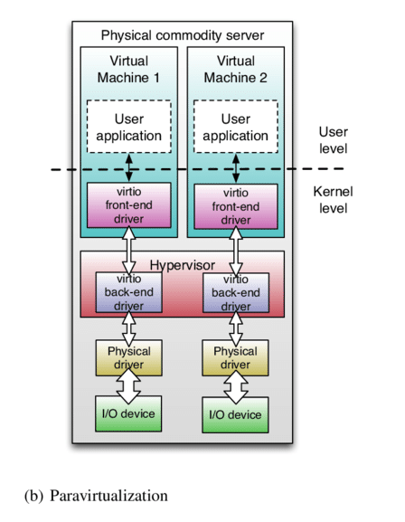
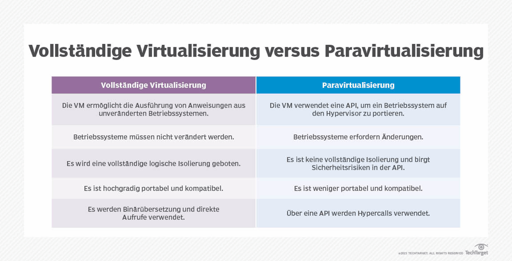

# Full-Virtualization vs. Paravirtualization

## Full-Virtualization:

**Definition**

Der Hypervisor bietet bei der Full-Virtualization oder vollständigen Virtualisierung eine vollständige Abstraktion durch eine softwarebasierte Virtualisierungsschicht. Abstrahierte Ressourcen werden einer oder mehreren logischen Einheiten (VMs – virtuelle Maschinen) zugeordnet (Typ1 Virtualisierung). Jede VM funktioniert in der Regel so als würde sie auf einem unabhängigen PC laufen. Jede VM ist logisch von den anderen VMs getrennt bzw. isoliert. Ansich kommunizieren VMs nicht miteinander und teilen auch keine Ressourcen außer man richtet es absichtlich ein (z.B. via Netzwerkkommunikation).

**(grobe) technische Funktionsweise**

Bei der Full-Virtualization werden die Hardwareressourcen eines Computers, wie Memory, Prozessoren, usw., durch einen Software-Hypervisor abstrahiert. Es werden logische Repräsentationen dieser Ressourcen für die jeweiligen logischen VMs bereitgestellt. Jede virtuelle Maschine denkt, sie hätte ihren eigenen „echten PC“. Jede VM hat ihre eigenen User Applikationen und einen virtuellen Gerätetreiber (virtual-device-driver). Der Hypervisor stellt eine spezielle Software Schicht dar. Die virtuellen Treiber kommunizieren nicht direkt mit der Hardware, sondern mit dem Hypervisor. Der Hypervisor übersetzt und leitet Anfragen der logischen Hardware an die physische Hardware weiter.  Die echten Treiber (physical driver) sprechen dann erst mit den Input/Output Geräten. 

**Anwendungen**

z.B.VMware oder VirtualBox
Fullvirtualisierung wird meist zu Testung verschiedener Betriebssysteme in der Entwicklung verwendet. Dabei kann auch alte Software verwendet werden, die vielleicht mit heutigen Standards nicht mehr zusammenpasst. Generell fokussiert man sich hier mehr auf die Systeme als auf die Performance. 

**Vorteil:**

Es ist keine Unterstützung durch das Betriebssystem erforderlich, um VMs zu erstellen. Betriebssysteme und weitere Anwendungen können dadurch ohne Änderungen ausgeführt werden, da der Hypervisor die vollständige Verwaltung der Ressourcen übernimmt und Anweisungen schnell übersetzt. 

**Nachteil:**

Anwendungen, die einen direkten Zugriff auf die zugrunde liegende Computerhardware erfordern funktionieren in einer VM nicht ordnungsgemäß. 

## Paravirtualization:
**Definition**

Bei der Paravirtualisierung handelt es sich um eine Virtualisierungsmethode, bei der das Betreibssystem in der virtuellen Maschine (VM) angepasst wird und auf einem Hypervisor-Programm ausgeführt wird. Die Kommunikation der VMs mit dem Hypervisor passiert über spezielle Treiber, was die Leistung verbessert. Dies funktioniert jedoch nicht auf jedem Betriebssystem. 

**(grobe) technische Funktionsweise**

Bei der Paravirtualisierung wird ein Betriebssystem in die Lage versetzt die Anwesenheit eines Hypervisors zu erkennen, es erkennt, dass es in einer virtuellen Umgebung läuft. Das Betriebssystem sendet Befehle an den Hypervisor sogenannte Hypercalls. Weiters werden auch angepasste Treiber (Abbtildung: „virtio front-end driver) in den VMs verwendet. Diese sprechen direkt mit dem passenden Treiber („virtio back-end driver) im Hypervisor. Von dort aus werden die Anfragen zum echten Gerätetreiber (physischen) weitergeleitet.  

**Anwendungen**

z.B. VMware und Xen
Xen ist hierbei ein Open-Source-Hypervisor, der auf der Paravirtualisierung basiert. 
Weitere Einsatzorte sind Server-Virtualisierung mit Performance Fokus oder Hosting von Webdiensten mit vielen gleichartigen Linux-VMs.

**Vorteil:**

Da die Paravirtualisierung auf der direkten Kommunikation zwischen Kernel des Gastbetriebssystems und dem zu Grunde liegenden Hypervisor in einem System beruht, konnte man in den Anfängen eine verbesserte Leistung und Systemauslastung gegenüber der Fullvirtualisierung bieten. 

**Nachteil:**

Ein wichtiger Kritikpunkt ist, dass ein Betriebssystem modifiziert werden muss bevor es für die Paravirtualisierung verwendet werden kann. Die meisten Betriebsysteme, die ordnungsgemäß für eine solche Verwendung modifiziert wurden sind Open Source. Windows Server unterstützt die Paravirtualisierung nicht, was zu großen Einschränkungen führt. 

## Übersicht: 

## Quellen:
https://www.computerweekly.com/de/tipp/Vollstaendige-und-Paravirtualisierung-Wichtige-Unterschiede
https://www.researchgate.net/figure/Mapping-an-I-O-device-using-full-virtualization-and-virtios-paravirtualization_fig26_279541668
https://www.it-talents.de/it-wissen/virtualisierungstechnologien-paravirtualisierung/

