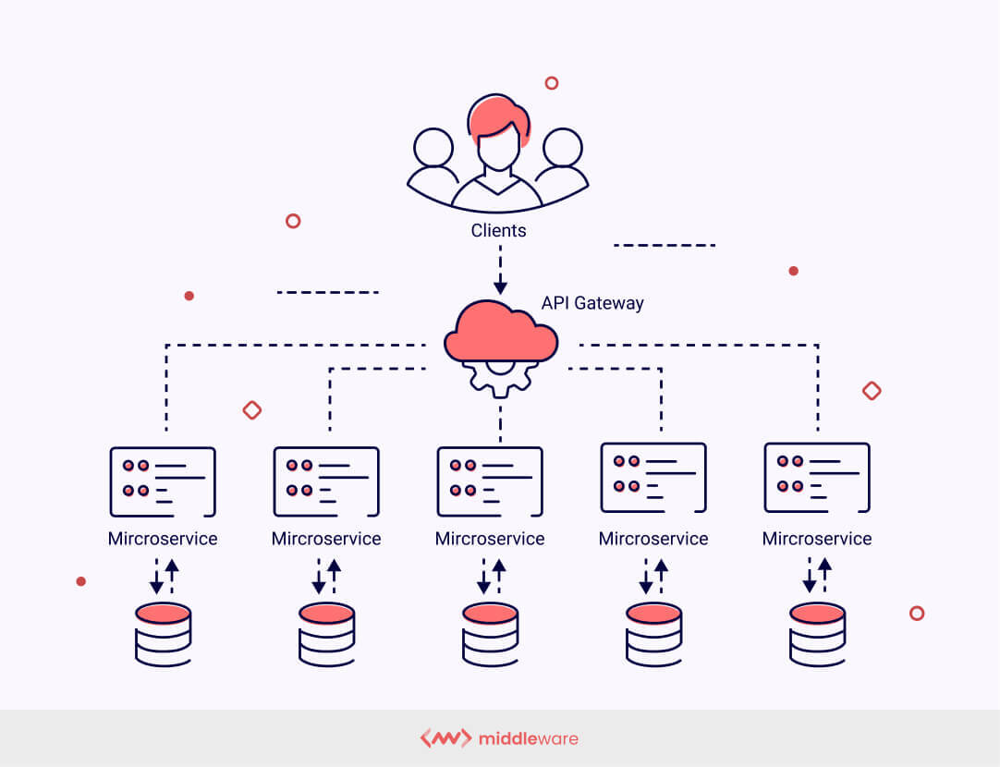

# What does „Cloud Native“ mean?
## Definition
Unter Cloud Nativ versteht man einen Ansatz zur Softwareentwicklung, bei der Anwendungen speziell für den Betrieb in der Cloud entwickelt werden. Dieser Ansatz zeichnet sich dadurch aus, dass man versucht skalierbare, flexible und belastbare Anwendungen für Cloud-Computing Umgebungen zu schaffen. Dazu werden moderne Technologien und Techniken verwendet, die dafür gemacht wurden, die Anwendungsentwicklung in einer Cloud-Infrastruktur zu unterstützen. 

## 4 Säulen des Cloud Native Ansatzes

https://cloudn.com.au/cloud-native-approach.html

Der Cloud-Native-Ansatz basiert auf 4 Säulen:

**-	Microservice-Technologien**

**-	Container-Technologien**

 Diese beiden stellen die Technologie Seite dar. Jene Technologien sind speziell für Cloud-Umgebungen entwickelt worden. Microservices erfüllen immer genau eine Funktion und können mit allem Nötigen für die Ausführung in einem Container zusammengefasst werden. Die Container selbst sind portabel und bieten Flexibilität. 

**-	DevOps-Prozesse**

**-	Continuous Delivery**

Diese stellen die Strategieseite dar. Bei einer gut funktionierenden Cloud-Native-Architektur sind nicht nur Entwicklerteams beteiligt, sondern auch der Betrieb. Man kann also sagen das Cloud-Native durch eine enge Zusammenarbeit vieler Beteiligten geprägt ist. Weiters versucht man gleich von Anfang an für die Endnutzer/innen die beste Lösung zu finden und entwickelt unter ständigen Austausch bestimmte Produkt-Features für die Microservices. Durch Continuous-Delivery-Prozesse werden jene dann automatisch ausgeliefert. 

## Microservice-Architektur 
**Microservice-Architektur:**

 Cloud-Native-Anwendungen bestehen aus mehreren einzelnen Diensten mit einer eigenen Laufzeitumgebung. Jene Dienste existieren unabhängig voneinander und sind nur lose miteinander verbunden. In der Kombination dieser ist man frei. Weiters ist es möglich diese Dienste für andere Anwendungen zu kopieren und wiederzuverwenden. Entwickler können bei dieser Architektur sich ein einzelnes Microservice rausnehmen und an diesem Änderungen vornehmen, während der Rest weiterarbeiten kann. 

 **API (Application Programming Interface):**

 Microservices kommunizieren über standardisierte Schnittstellen (APIs) – sie werden qusai über diese Schnittstelle zusammengebunden. Über den API wird dem Benutzer mitgeteilt, welche Daten gebraucht werden und welche Ergebnisse geliefert werden können. Der Benutzer soll das Gefühl haben, als rede er nur mit nur mit einer einzigen Anwendung. 

 

 https://middleware.io/blog/microservices-architecture/?ref=blog.treblle.com

## Vorteile

**Verfügbarkeit:**

Bei einer Cloud-Natvie-Architektur ist es möglich Veränderungen in Echtzeit auszurollen, wodurch sie dem Nutzer direkt nach dem der entsprechende Code ausgeführt zur Verfügung stehen. Durch die Microservices sind NCAs (Native Cloud Anwendungen) voneinander unabhängig, wodurch die Ausfallsicherheit erhöht wird. 

**Flexibilität:**

Die Flexibilität des Cloud-Native-Ansatzes kommt daher, da alle Dienste unabhängig von ihrer Umgebung ausgeführt werden und auch die Container der Microservices sehr portabel sind. Dadurch bekommen die Entwickler ein großes Maß an Freiheit. Man kann beispielsweise mehrere Instanzen eines Containers starten oder stoppen. Vor allem bei der Entwicklung stellt dies einen großen Vorteil dar. Weiters wirken sich Veränderungen im Code der einzelnen Microservices nicht auf die gesamte Software aus, wodurch ein kleineres Risiko bei Software-Releases gegeben ist.

**Skalierbarkeit:**

Das System kann skaliert werden ohne kostspielige Hardware-Upgrades vorzunehmen. Cloud Native Anwendungen sind in kleine Einheiten unterteilt (Microservices). Diese können leicht vervielfältigt werden und haben die Fähigkeit je nach Last automatisch hoch- oder runterzuskalieren.

**Vermeidung von Lock-in-Effekten:**

Die verwendeten Dienste sind nicht an bestimmte Hardware oder an ein bestimmtes Betriebssystem gekoppelt, wodurch keine feste Bindung zu einem bestimmten Anbieter besteht. Daher lassen sich Cloud-Native-Anwendungen auf beliebigen Plattformen durchführen. Der Betrieb kann seinen Provider selbst wählen, der preis-leistungsmäßig am besten für die jeweiligen Anforderungen passt. 

**Aktualität und Automatisierung:**

Updates und Veränderungen stehen in einer Cloud-Native-Architektur schnellstmöglich zur Verfügung, wodurch man als Unternehmen auf Marktanforderungen und Kundenwünsche gut reagieren kann. Dies wird vor allem durch den hohen Automatisierungsgrad erzielt. Durch Automatisierung werden viele manuelle Aufgaben (Änderungen vornehmen, Monitoring, …) von bestimmten Tools automatische erledigt. Als Beispiel: Infrastruktur as a Code (IaC) (Infrastruktur wird mit Code definiert und verändert), Monitoring und Alerts (automatische Fehlersuche und Meldung)

## Quellen:

https://www.ionos.de/digitalguide/websites/web-entwicklung/was-ist-cloud-native/
https://aws.amazon.com/what-is/cloud-native/
https://datascientest.com/de/cloud-native-prinzipien-merkmale-und-vorteile
