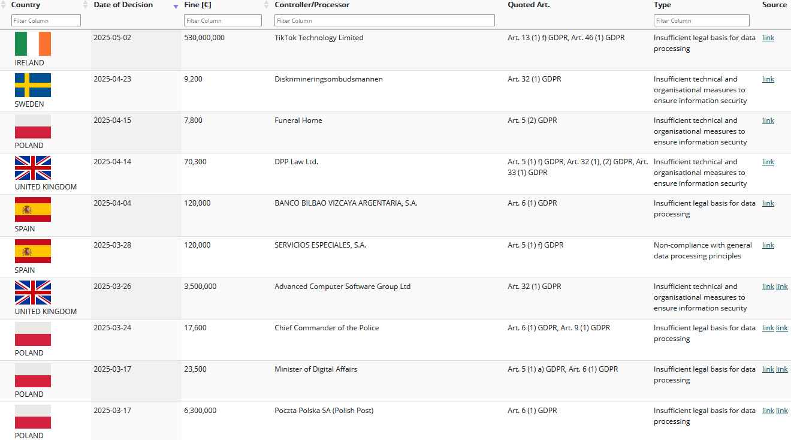

# Thema: DSGVO und Cloud
Die **Datenschutzgrundverordnung** (DSGVO) ist eine **Verordnung der Europäischen Union**, die seit dem 25. Mai 2018 in der EU sowie im EWR gilt.  Ergänzend zur DSGVO haben die einzelnen Mitgliedstaaten nationale Gesetze, wie in Deutschland das BDSG oder in Österreich das DSG. 
Ihr Regelungsgehalt umfasst vor allem die **Kontroll- und Transparenzvorschriften**, die Unternehmen bei der **Verarbeitung von personenbezogenen Daten** einhalten müssen.1 Personenbezogene Daten sind Daten, die Personen identifizierbar machen, wie beispielsweise Name, Adresse, Geburtsdatum, Bankverbindung, Personenfotos, KFZ-Kennzeichen oder IP-Adressen.2 Die Verarbeitung dieser Daten bedeutet, sie zu erheben, zu speichern, zu löschen oder zu verändern.3 

## Cloud-Computing im Kontext der DSGVO
Der Begriff *Cloud-Computing* beschreibt die Bereitstellung von Computerdiensten, beispielsweise Server, Speicher oder Datenbanken, über das Internet.4 Cloud-Anbieter stehen vor der Herausforderung, die Vorgaben der DSGVO einzuhalten. Auch sonstige Unternehmen stehen vor der Frage, unter welchen Bedingungen sie personenbezogene Daten in der Cloud verarbeiten dürfen. 
Der Cloudanbieter ist nach der DSGVO der *Auftragsverarbeiter*, wenn er personenbezogene Daten im Auftrag eines *Verantwortlichen* (z.B. eines Unternehmens) verarbeitet.5

## Territorialer Anwendungsbereich der DSGVO
Die DSGVO gilt auch dann, wenn personenbezogene Daten von EU/EWR-Bürgern außerhalb der EU bzw. des EWR verarbeitet werden. Das bedeutet, dass die DSGVO auch gilt, wenn Unternehmen Cloud-Anbieter im EU-Ausland als Auftragsverarbeiter in Anspruch nehmen.5

## Grundsätze für die Verarbeitung personenbezogener Daten
In Art. 5 DSGVO finden sich sieben Grundsätze für den Datenschutz nach DSGVO:
1) **Rechtmäßigkeit, Verarbeitung nach Treu und Glauben und Transparenz** müssen bei der Datenverarbeitung gewährleistet sein
2) **Zweckbindung**: Verantwortliche dürfen personenbezogene Daten nur sammeln, wenn es dafür einen originär festgelegten und legitimen Grund gibt
3) **Datenminimierung**: Verantwortliche dürfen nur die personenbezogenen Daten erfassen, die tatsächlich notwendig sind, um diesen legitimen Grund zu verfolgen
4) **Richtigkeit**: Verantwortliche müssen personenbezogene Daten sachlich richtig und auf dem neusten Stand halten
5) **Speicherbegrenzung**: Eine Speicherung darf nur solange erfolgen, wie sie für den Zweck erforderlich ist.
6) **Integrität und Vertraulichkeit**: Verantwortliche müssen personenbezogene Daten vor unbefugter Verarbeitung, unbeabsichtigten Verlust und unbeabsichtigter Zerstörung durch geeignete technische und organisatorische Maßnahmen schützen
7) **Rechenschaftspflicht**: Verantwortliche müssen die Einhaltung der Grundsätze 1-6 nachweisen können3

Wenn ein Unternehmen Cloud-Services in Anspruch nimmt, muss es sicherstellen, dass alle diese Grundsätze eingehalten werden können, nicht nur der Sicherheitsaspekt. Wichtige Fragen sind hier, ob der Cloud-Provider die personenbezogenen Daten für eigene Zwecke nutzt oder sie an Behörden von Drittstaaten weitergibt.

Weiters muss Datenschutz "by design and by default" gemäß Art. 25 DSGVO beachtet werden. Das bedeutet, dass, wenn ein Verantwortlicher eine Cloud-Lösung in Anspruch nimmt, dieser prüfen muss, ob die Cloud-Lösung die Einhaltung der sieben Grundsätze gewährleistet. Voreinstellungen, beispielsweise in einer SaaS-Lösung, müssen entsprechend der Prinzipien der Datenminimierung, Speicherbegrenzung und Vertraulichkeit angepasst werden. Wichtige Fragen sind hier, ob personenbezogene Daten Administratoren zugänglich sind, obwohl dies keinen administrativen oder sicherheitstechnischen Zweck hat oder ob es ohne hohen Aufwand möglich ist, personenbezogene Daten in der Cloud zu löschen, ohne dadurch andere Daten unbrauchbar zu machen. Dies zu überprüfen liegt in der Verantwortung des Unternehmens, nicht in der des Cloud-Service-Dienstleisters 5

## Individuelle Rechte
Die DSGVO verleiht EU-Bürgern individuelle, durchsetzbare Rechte.
1) **Recht auf Information**: Verantwortliche müssen Personen bestimmte Informationen zur Verarbeitung bereitstellen, beispielsweise den Zweck der Verarbeitung oder die Datenübermittlung in Drittländer. (Art. 12, 13 und 14)
2) **Recht auf Auskunft**: Verantwortliche müssen Personen auf Anfrage Zugang zu einer Kopie der über sie verarbeiteten Daten gewähren. (Art. 15)
3) **Recht auf Berichtigung**: Verantwortliche müssen unrichtige personenbezogene Daten auf Anfrage unverzüglich berichtigen. (Art. 16)
4) **Recht auf Löschung**: Verantwortliche müssen unter gewissen Voraussetzungen personenbezogene Daten auf Anfrage unverzüglich löschen. (Art. 17)
5) **Recht auf Einschränkung der Verarbeitung**: Wenn eine Organisation die Daten eigentlich nicht mehr benötigt und sie normalerweise löschen würde, kann die betroffene Person verlangen, dass die Daten dennoch gespeichert bleiben, etwa zur Geltendmachung, Ausübung oder Verteidigung von Rechtsansprüchen. (Art. 18)

Wichtig ist hier, dass der Verantwortliche bei Verwendung von Cloud-Services für die Erfüllung dieser individuellen Ansprüche verantwortlich ist, nicht der Cloud-Provider. Dieser muss daher eingehend prüfen, ob ein Cloud-Provider die Möglichkeit bietet, Auskunftsersuchen, Berichtigungen, Löschanfragen oder Datenportabilitätsanfragen zu erfüllen. Weiters muss gefragt werden, ob es ein Exporttool gibt, das alle relevanten Daten in einem zugänglichen Format liefert oder, falls dies nicht der Fall ist, wie viel zusätzlicher manueller Aufwand erforderlich ist, um die verbleibenden Daten zu identifizieren und bereitzustellen.5

## Besondere Vorschriften zur Auftragsverarbeitung
Art. 28 DSGVO enthält besondere Vorschriften für die Auftragsverarbeitung. 
Pflichten von Auftragsverarbeitern:
1) **Verarbeitung nur auf dokumentierte Weisung** (meist ein Vertrag zwischen Verantwortlichem und dem Auftragsverarbeiter, dieser muss unbedingt festlegen, welche Art von personenbezogenen Daten verarbeitet werden sowie was Gegenstand und Zweck der Verarbeitung sind)
2) **Vertraulichkeit** wahren
3) **Sicherheitsmaßnahmen** treffen
4) **Subverarbeiter nur mit Zustimmung** einsetzen
5) **Verantwortlichen unterstützen** bei Auskunftsersuchen, Datenschutz-Folgeabschätzungen und Meldungen von Data Breaches
6) Personenbezogene **Daten nach Vertragsende löschen/zurückgeben**
7) **Audits ermöglichen** und **Nachweise für die Einhaltung der DSGVO** vorlegen

Der Verantwortliche trägt die Pflicht, bei der Wahl des Auftragsverarbeiters sicherzustellen, dass dieser ausreichende technische und organisatorische Maßnahmen implementiert hat, um die Vorschriften der DSGVO bei der Verarbeitung einzuhalten. 

Der Verantwortliche ist für betroffene Personen der erste Ansprechpartner. Auch wenn eine DSGVO-Verletzung technisch durch die Cloud-Lösung verursacht wurde, haftet das nutzende Unternehmen. Wenn beispielsweise ein Cloud-Dienst nicht erlaubt, Daten zu exportieren, zu löschen oder zu beschränken, kann eine betroffene Person nur eine Beschwerde gegen das Unternehmen einreichen und nicht gegen den Cloud-Anbieter.

Das bedeutet allerdings nicht, dass der Cloudanbieter bzw. Auftragsverarbeiter frei von jeglicher Haftung ist. Nach Art. 82 EU-DSGVO haftet er mit dem Verantwortlichen gemeinsam. Jedoch beschränkt sich seine Haftung nach Abs. 2 auf Verstöße gegen die speziell ihm auferlegten Pflichten. Beiden Parteien haben jedoch die Möglichkeit nachzuweisen, dass sie in keinerlei Hinsicht für den Umstand, durch den der Schaden eingetreten ist, verantwortlich sind.6

## Sicherheit
### ISO-27001-Zertifizierung
Ein guter Anhaltspunkt, ob ein Cloud-Provider den Sicherheitsanforderungen der DSGVO entspricht, ist, wenn er ISO-27001-zertifiziert ist. Wichtig ist jedoch zu beachten, dass vor allem bei der Nutzung von SaaS-Diensten in der Regel mehrere Akteure beteiligt sind, der SaaS-Anbieter, der IaaS-Anbieter sowie der Rechenzentrumsbetreiber der IaaS-Anbieter. Ist einer dieser drei zertifiziert, bedeutet das nicht, dass es die anderen auch sind. Weiters muss der Umfang der Zertifizierung geprüft werden, es reicht nicht, wenn beispielsweise nur die Tätigkeiten der Personalabteilung des Anbieters abdeckt, nicht aber den Cloud-Dienst selbst. Auch die Version der verwendeten ISO-27001-Norm ist entscheidend, da unterschiedliche Versionen unterschiedliche datenschutzrechtliche Anforderungen aufweisen. Es sollte daher geprüft werden, ob der Anbieter eine aktuelle Version verwendet. Eine ISO-27001-Zertifizierung zeigt, dass ein Anbieter ein systematisches Sicherheitsmanagement betreibt. Das bedeutet jedoch nicht automatisch, dass die Risikoeinschätzung des Anbieters mit jener des nutzenden Unternehmens übereinstimmt. Bei besonders sensiblen Datenverarbeitungen ist es oft sinnvoll, mit dem Anbieter zu klären, welche Risiken er identifiziert hat und welche Sicherheitsmaßnahmen er umgesetzt hat.5
### Schutz vor extraterritorialen Gesetzen von Drittländern
Art. 48 DSGVO besagt:
> Jegliches Urteil eines Gerichts eines Drittlands und jegliche Entscheidung einer Verwaltungsbehörde eines Drittlands, mit denen von einem Verantwortlichen oder einem Auftragsverarbeiter die Übermittlung oder Offenlegung personen bezogener Daten verlangt wird, dürfen unbeschadet anderer Gründe für die Übermittlung gemäß diesem Kapitel jedenfalls nur dann anerkannt oder vollstreckbar werden, wenn sie auf eine in Kraft befindliche internationale Übereinkunft wie etwa ein Rechtshilfeabkommen zwischen dem ersuchenden Drittland und der Union oder einem Mitgliedstaat gestützt sind.

Mitarbeitende eines Cloud-Dienstleisters sind berechtigt, einer rechtmäßigen Anordnung einer Polizei- oder Justizbehörde eines EU-Mitgliedstaates nachzukommen. Für Drittstaaten gilt das jedochn nur, wenn es dafür eine internationale Übereinkunft zwischen dem Drittstaat und der EU gibt. Diese Problematik ist besonders relevant bei US-amerikanischen Cloud-Anbietern, da die USA als Drittland gilt. Solche Anbieter betonen regelmäßig, wie sorgfältig sie Anfragen von US-Behörden gemäß US-Recht nachkommen, was dem Ziel der DSGVO entgegensteht, solche Weitergaben zu verhindern.5

### Data Breaches
Laut Art. 33 Absatz 5 DSGVO müssen Verantwortliche bei einem Data Breach, also einer Sicherheitsverletzung, die zur unbeabsichtigten oder unrechtmäßigen Zerstörung, zum Verlust, zur Veränderung, zur unbefugten Offenlegung oder zum Zugriff auf personenbezogene Daten führt, die Fakten, die Auswirkungen sowie die ergriffenen Abhilfemaßnahmen dokumentieren. Je nach Schwere des Data Breaches muss dieser zusätzlich an die Aufsichtsbehörde und auch an betroffene Personen gemeldet werden.
Der Verantwortliche muss sich also überlegen, wie der Cloud-Provider diesen Data Breach meldet und ob dieser den Data Breach rechtzeitig erkennen, bewerten und die Meldung einleiten kann.5

## Verzeichnis von Verarbeitungstätigkeiten
Organisationen mit mehr als 250 Mitarbeitenden müssen laut Art. 30 DSGVO ein Verzeichnis der Verarbeitungstätigkeiten führen. Dies hilft dabei, Datenverarbeitungsverträge mit Cloud-Anbietern schneller und vollständiger abzuschließen.5

## Bußgelder
Die DSGVO nicht einzuhalten zahlt sich nicht aus. Auf der Plattform [GDPR Enforcement Tracker](https://www.enforcementtracker.com/) werden alle DSGVO-Bußgelder dokumentiert.7 Ein Auszug von der Webseite:

Hier sieht man unter anderem, dass Tiktok mit einem Bußgeld von 530 Millionen belegt wurde. Das Unternehmen hat Daten von europäischen Nutzern auf Server in China übertragen, was gegen die Transparenzanforderungen verstoßen hat. Man kann nicht ausschließen, dass chinesische Behörden die persönliche Daten von EU-Bürgern ausgewertet haben. Neben dem Bußgeld muss das Unternehmen seine Plattform innerhalb von sechs Monaten so anpassen, dass es der DSGVO entspricht.8

# Quellen
1 [datenschutz-grundverordnung.eu | Inhalte der EU-Datenschutz-Grundverordnung (EU-DSGVO)](https://datenschutz-grundverordnung.eu/)

2 [wiso-net.de | Cloud und DSGVO: Gegensätze ziehen sich an? (2019). Behörden Spiegel, 6.](https://www.wiso-net.de/docPreview/exlibris/BSPI__BSPI_20190605_029_01_06)

3 [DSGVO](https://eur-lex.europa.eu/eli/reg/2016/679/oj?locale=de)

4 [Microsoft | Was ist Cloud Computing?  | SDN](https://azure.microsoft.com/de-de/resources/cloud-computing-dictionary/what-is-cloud-computing)

5 [cleura | GDPR and the cloud – an introduction](https://cleura.com/cloudguide/guides/gdpr-and-the-cloud-an-introduction/)

6 [dsgvo-gesetz.de | Auftragsverarbeitung](https://dsgvo-gesetz.de/themen/auftragsverarbeitung/)

7 [enforcementtracker.com | GDPR Enforcement Tracker](https://www.enforcementtracker.com/)

8 [SPIEGEL | TikTok muss wegen Datenschutzverstößen 530 Millionen Euro Strafe zahlen](https://www.spiegel.de/netzwelt/netzpolitik/tiktok-muss-wegen-datenschutzverstoessen-530-millionen-euro-strafe-zahlen-a-e867b70a-f4a4-4f5d-ba87-d099776e1c63=)
