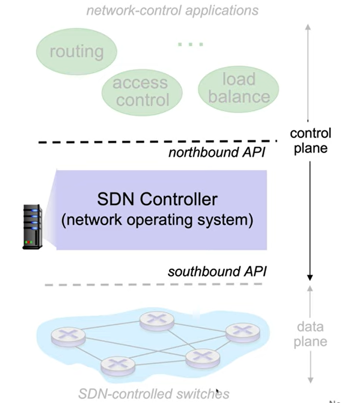
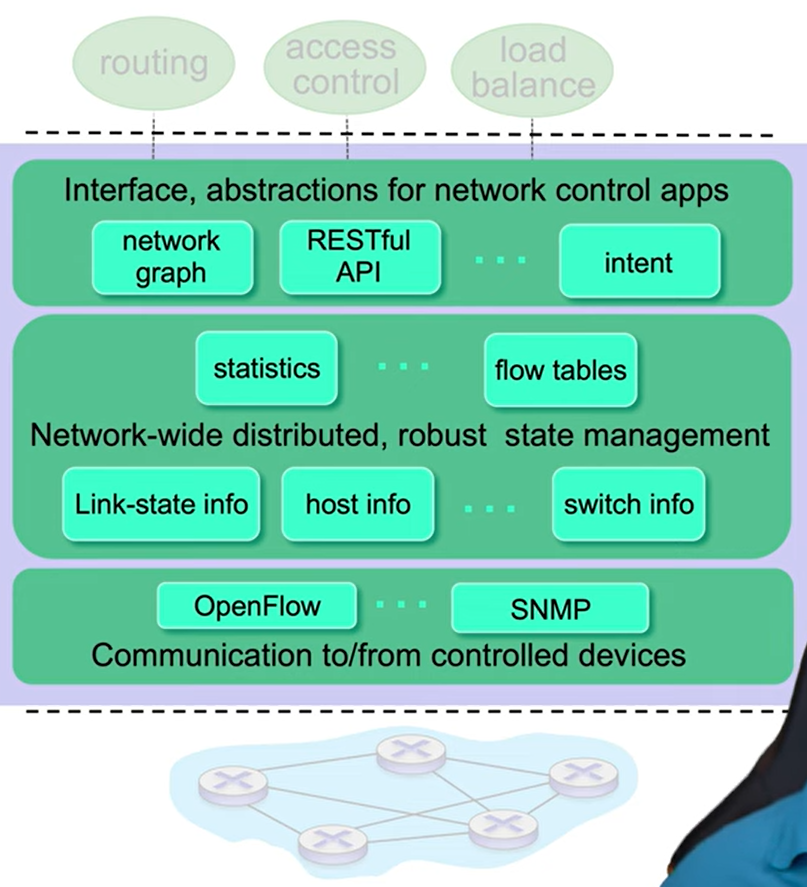

# Thema: SDN
**Software Defined Networking** (SDN) ist ein **Netzwerkkonzept**, das die zentrale und intelligente Verwaltung einzelner Hardwarekomponenten mithilfe von Software ermöglicht. Dies wird erreicht, indem man die _Control Plane_ und die _Data Plane_ nicht wie in traditionellen Netzwerken auf den Netzwerkkomponenten kombiniert, sondern ein SDN-Controller die _Control Plane_ übernimmt und damit die gesamte Netzwerkstruktur verwaltet.  

Diese **Virtualisierung des Netzwerks** (Trennung der Netzwerkfunktionen von der darunterliegenden Hardware) bringt **viele Vorteile** mit sich. Es macht das Netzwerk flexibler, programmierbarer und einfacher zu verwalten. Durch *Zero Touch Provisioning* kann ein Administrator, ohne selbst auf das Gerät zugreifen zu müssen, dieses automatisiert mithilfe vorgefertigter *Templates* konfigurieren lassen.  Es reduziert weiters die Fehleranfälligkeit bei der Konfiguration und ermöglicht eine zentrale End-to-End-Übersicht über das ganze Netzwerk. 

### Wichtige Grundsätze von SDN
1. **_Central intelligence_**: Die _Control plane_ (Teil eines Netzwerks, der Signalverkehr trägt und für das Routing verantwortlich ist) ist zentralisiert im SDN-Controller.
2. **_Intent Based Networking_**: Ein Netzwerkadministrator kann einen gewünschten Zustand des Netzwerks auf einer höheren Abstraktionsebene angeben. Diese Angabe wird dann vom System automatisch in die benötigten Konfigurationsschritte umgesetzt.
### Anwendungen von SDN
- Verwalten von Netz-Ressourcen
- Verwalten von Firewall-Regeln
- Datenverkehr zentral und herstellerunabhängig steuern
- Bandbreitenzuteilung bei spontan ansteigender Netzlast
- Übersicht über den aktuellen Status und den Nutzungsgrad aller Komponenten und Leitungen

## In welchem Kontext wird SDN verwendet?
Der ursprüngliche Hauptanwendungsfall von SDN war, dass ein intelligenter Controller mit spezialisierter Software den gesamten Netzwerkverkehr eines **Rechenzentrums** verwaltet, während Router und Switches die Datenpakete weiterleiten.

Heute hat sich der SDN-Markt weiterentwickelt und verlässt das Rechenzentrum. SDN wird im Weitverkehrsnetz eingesetzt, um zu steuern, wie Unternehmen mit ihren Zweigstellen verbunden sind. Das sogenannte **SD-WAN** nutzt Software, um verschiedene Netzwerkverbindungen wie Breitband oder Mobilfunk zu bündeln, um leistungsfähige und kostengünstige Verbindungen zu schaffen.

SDN wird mithilfe des Konzepts der **Mikrosegmentierung** auch für die Netzwerksicherheit eingesetzt. Dabei wird der Netzwerkverkehr segmentiert. Bestimmte Netzwerke können besonders abgesichert werden und sensible Daten transportieren, während andere öffentlich zugänglich sind. Wird ein bestimmter Netzwerkbereich kompromittiert, wird der Schaden nur auf diesen Bereich begrenzt.

SDN wird auch in **Network Function Virtualization** eingesetzt. Hierbei wird spezialisierte Hardware wie Firewalls und Load Balancer durch Software ersetzt, die auf handelsüblicher Serverhardware läuft.

Einige Anbieter nutzen SDN, um Rechenzentren mit **Public-Cloud-Anbietern** zu verbinden. Dadurch schafft man ein hybrides Cloud-Netzwerk mit Mikrosegmentierung und dynamischer Skalierung. Andere SDN-Anwendungen helfen dabei, die Flut an Daten aus dem Internet der Dinge zu bewältigen, indem sie den Netzwerkverkehr segmentieren und die Daten organisieren.

## Technische Funktionsweise

Der SDN Controller ist eine Anwendung, die auf einem Server läuft. Es kann als das Betriebssystem bezeichnet werden, das die Ressourcen des gesamten Netzwerks managt. Dieser Controller die Übersicht über die Netzwerk-Status-Information haben. Im Idealfall ist der SDN-Controller über mehrere Server verteilt, um keinen Single-Point-of-Failure zu haben. 
### SDN-Architektur
Die SDN-Architektur hat drei Schichten:
1. **Applikationsebene**: Hier befinden sich die Netzwerkapplikationen wie beispielsweise Sicherheitsrichtlinien oder Verkehrsmanagement. Über die *Northbound-API* kommuniziert der SDN-Controller mit den Applikationen für die Netzwerksteuerung, beispielsweise RESTful APIs. 
2. **Steuerungsschicht**: Der SDN-Controller übersetzt die Anforderung der Netzwerkapplikationen in Netzwerkregeln. Mit *East-West-APIs* können mehrere Controller miteinander kommunizieren, um Redundanz und Lastverteilung zu erreichen.
3. **Infrastrukturschicht**: Switches und Router führen die vom Controller vorgegebenen Regeln aus. Der SDN-Controller kommuniziert mit diesen über *Southbound-APIs*, beispielsweise OpenFlow oder NETCONF.

Die technische Funktionsweise im Betrieb sieht so aus, dass Netzwerkgeräte neue Verbindungen bzw. Statusänderungen an den SDN-Controller weiterleiten. Dieser entscheidet dann auf Basis aktueller Netzwerkdaten, wie der Datenverkehr weitergeleitet werden soll. Diese Regeln werden über die Southbound-API an die entsprechenden Netzwerkgeräte verteilt.

### Technische Funktionsweise des SDN-Controllers

Viele Details der technischen Funktionsweise sind abhängig vom jeweiligen SDN-Controller. Grundsätzlich hat ein Controller Komponenten, die es ihm ermöglichen, mit Switches zu kommunizieren, beispielsweise das OpenFlow-Protokoll oder SNMP. Weiters muss der Controller den Überblick über den Status des Netzwerks behalten, beispielsweise welche Geräte mit dem Controller verbunden sind. Zusätzlich muss er wissen, welche Flow-Tables (Liste von Regeln in einem SDN-Netzwerk) den Switches gegeben wurden und er sollte Statistiken von diesen Flow-Tables auslesen können, um Daten über die Gerätenutzung zu erhalten und den Traffic-Flow im Netzwerk. Dann gibt es die API, das mit den Netzwerksteuerungsapplikationen kommunizieren kann. Dieses kann entweder relativ simpel sein oder einen Überblick über den Zustand des Netzwerkes bieten. Beispiele sind hier Netzwerkgraphen-Abstraktionen, eine RESTful-API oder ein Konzept für Richtlinien-Intentionen.

## Gängige Protokolle und Tools
### Protokolle
Das mit Abstand verbreiteste Protokoll für die Kommunikation zwischen SDN-Controller und Switches ist **OpenFlow**, welches von der Open Networking Foundation verwaltet wird. Es tritt in vielen SDN-Netzen an die Stelle der einzelnen verschiedenen Schnittstellen der Netzwerkgeräte, womit auch die Abhängigkeit von Hardware-Herstellern gemindert wird. Das OpenFlow-Protokoll arbeitet zwischen Controller und Switch. Es läuft über TCP und unterstützt in neueren Versionen auch Verschlüsselung. OpenFlow-Nachrichten lassen sich in drei Kategorien einteilen: Controller-zu-Switch-Nachrichten (zum Beispiel das Bereitstellen neuer Flow-Table-Regeln), asynchrone Nachrichten (bei denen der Switch dem Controller freiwillig Informationen meldet) und symmetrische Nachrichten (bei denen beispielsweise der Controller Informationen vom Switch abfragt). 

Einige wichtige Controller-zu-Switch-Nachrichten umfassen beispielsweise Anfragen des Controllers an den Switch, um zu erfahren, welche Funktionen dieser unterstützt. Der Controller kann außerdem Konfigurationsnachrichten senden, um den Status bestimmter Einstellungen abzufragen oder zu setzen. Flow-Tabellen können durch "Modify State"-Nachrichten manipuliert werden. Besonders interessant ist die "Packet-Out"-Nachricht, bei der der Controller ein Paket kapselt und dem Switch mitteilt, es über einen bestimmten Port zu versenden.

Auf der Switch-zu-Controller-Seite gibt es Nachrichten wie "Packet-In", bei denen der Switch ein unbekanntes Paket an den Controller weiterleitet, damit dieser entscheidet, wie es behandelt werden soll. Es gibt auch "Flow-Removed"-Nachrichten, wenn ein Flow-Eintrag abgelaufen und aus der Tabelle gelöscht worden ist. Der Switch kann dem Controller zudem Änderungen am Status seiner Ports melden, was genutzt werden kann, um etwa eine Link-State-Routing-Funktion zu ermöglichen.

OpenFlow ist aber nicht das einzige Protokoll für das Management von SDNs. Mit **NETCONF** (RFC 6241), **BGP** (Border Gateway Protocol), **XMPP** (Extensible Messaging and Presence Protocol), **OVSDB** (Open vSwitch Database Management Protocol) und **MPLS-TP** (MPLS Transport Profile) gibt es Alternativen, die das Standard-Protokoll zwar nicht eins zu eins ersetzen, die bei der Realisierung softwaredefinierter Netzwerke aber trotzdem eine entscheidende Rolle spielen können. Auch proprietäre Protokolle von Cisco Systems und Nicira sind in einigen Architekturen im Einsatz.

### Tools
Es gibt zahlreiche SDN-Plattformen mit unterschiedlichen Stärken. **OpenDaylight** beispielsweise ist darauf fokussiert, 
Legacy-Technologien wie BGP oder SNMP und Next-Generation-Netzwerke wie OpenFlow und SDN zusammenzuführen und zu integrieren. **ONOS** hingegen legt den Fokus mehr auf Performance und Clustering um die Verfügbarkeit und Skalierbarkeit zu erhöhen. 

# Quellen
[Youtube: What is software-defined networking (SDN)?](https://www.youtube.com/watch?v=Z5Gi2Bpd82M)

[Youtube: Introduction to Software-Defined Networking | SDN](https://www.youtube.com/watch?v=VtzfsRisLb8)

[Youtube:  Software Defined Networks & OpenFlow - IP Network Layer | Computer Networks Ep. 5.5 | Kurose & Ross ](https://www.youtube.com/watch?v=DKP54Ed9ovo)

[IONOS | SDN: Das steckt hinter Software Defined Networking](https://www.ionos.at/digitalguide/server/knowhow/software-defined-networking/)

[Elektronik Kompendium | SDN - Software Defined Networking](https://www.elektronik-kompendium.de/sites/net/2507021.htm)

[CloudSmartz | ONOS and ODL: Know the difference](https://cloudsmartz.com/insights/onos-and-odl-know-the-difference/)
