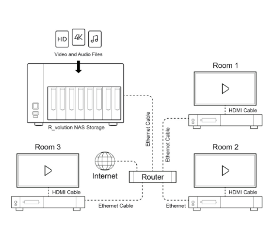

NAS.md

## Inhaltsverzeichnis

1. [Was ist ein NAS?](#was-ist-ein-nas)
2. [Architektur](#architektur)
3. [Gängige Protokolle](#gängige-protokolle)
4. [Anwendungsfälle](#anwendungsfälle)
5. [Vorteile und Nachteile](#vorteile-und-nachteile)
6. [Quellen](#quellen)

## Was ist ein NAS? - Definition

NAS steht für „Network Attached Storage“ und bezeichnet ein Speichersystem, das über ein Netzwerk erreichbar ist. Anders als bei einer lokal angeschlossenen Festplatte (z. B. USB) können bei einem NAS mehrere Benutzer gleichzeitig auf zentrale Daten zugreifen – unabhängig vom Gerätetyp oder Betriebssystem.

Ein NAS ist in der Regel ein kleines, spezialisiertes Gerät mit mehreren Festplatten, das als Datei-Server dient. Es arbeitet eigenständig, benötigt keinen angeschlossenen PC oder Server und bietet häufig zusätzliche Funktionen wie automatische Backups, Medienserver oder Benutzerverwaltung. Moderne NAS-Systeme sind leicht zu bedienen und werden vor allem im Privatbereich aber auch immer mehr in Firmen verwendet.

Auf dem Bild sieht man das Prinzip eines NAS ganz gut. Auf dem NAS können Dateien, Videos, Musik und Filme liegen welche von anderen Netzwerkgeräten wie SmartTVs oder PCs abgerufen werden können.

## Architektur

Ein NAS (Network Attached Storage) besteht aus mehreren Komponenten, die gemeinsam dafür sorgen, dass Daten zentral gespeichert, geschützt und über das Netzwerk bereitgestellt werden können.

Typische Bestandteile:

- **Gehäuse mit mehreren Festplatteneinschüben**  
  Ermöglicht Speichererweiterung und Redundanz über RAID (z. B. RAID 1 oder RAID 5).

- **Prozessor (CPU) und Arbeitsspeicher (RAM)**  
  Verantwortlich für den Betrieb des Systems, Dateizugriffe, Dienste wie Medienserver oder Backupfunktionen.

- **Netzwerkschnittstelle**  
  Meist Ethernet (1 Gbit/s oder mehr), teilweise auch mit mehreren Ports für Link Aggregation (z. B. LACP (=Link Aggregation Control Protocol)).

- **NAS-Betriebssystem**  
  Häufige Beispiele sind **Synology DSM**, **QNAP QTS** oder **TrueNAS Core**. Sie bieten grafische Weboberflächen, Benutzerverwaltung, App-Stores und Sicherheitsfunktionen.

- **RAID-Controller oder Software-RAID**  
  Dient der Absicherung gegen Festplattenausfälle. Je nach Konfiguration können Daten im laufenden Betrieb gespiegelt oder verteilt werden.

## Gängige Protokolle

Ein NAS nutzt verschiedene Netzwerkprotokolle, um Dateien bereitzustellen und von unterschiedlichen Geräten aus zugänglich zu sein. Je nach Betriebssystem oder Anwendungsfall kommen unterschiedliche Protokolle zum Einsatz:

- **SMB / CIFS (Server Message Block)**  
  Hauptsächlich in Windows-Umgebungen verwendet. Ermöglicht Dateifreigaben, Netzlaufwerke und Druckerfreigaben.

- **NFS (Network File System)**  
  Kommt vor allem bei Linux- und UNIX-Systemen zum Einsatz. Wird gerne für leistungsstarke Serverumgebungen genutzt.

- **AFP (Apple Filing Protocol)**  
  Älteres Apple-Protokoll für die Dateifreigabe. Wird heute zunehmend durch SMB ersetzt.

- **FTP / SFTP (File Transfer Protocol / Secure FTP)**  
  Für einfachen oder verschlüsselten Datei-Upload und -Download – auch über das Internet. Wird z. B. für Webserver oder automatisierte Backups verwendet.

- **WebDAV (Web-based Distributed Authoring and Versioning)**  
  Ermöglicht Zugriff auf Dateien über HTTP/HTTPS – kompatibel mit vielen Apps und Plattformen.

- **DLNA / UPnP**  
  Dient dem Medienstreaming im Heimnetz (z. B. an Smart TVs, Lautsprecher oder Konsolen).

Viele NAS-Systeme unterstützen diese Protokolle parallel – Nutzer können je nach Gerät und Zweck das passende wählen.

## Anwendungsfälle

Ein NAS kann in verschiedensten Szenarien eingesetzt werden – sowohl im privaten als auch im beruflichen Kontext. Hier sind typische Anwendungsbeispiele:

### Privater Einsatz

- **Zentrale Datenspeicherung**  
  Fotos, Videos, Musik und Dokumente werden für alle Geräte im Haushalt zentral abgelegt.

- **Automatisches Backup**  
  PCs, Laptops und Smartphones können regelmäßig auf das NAS gesichert werden – oft auch zeitgesteuert.

- **Medienserver**  
  Über DLNA, Plex oder ähnliche Tools kann das NAS als Streaming-Quelle für Filme und Musik dienen.

- **Cloud-Ersatz / Remote-Zugriff**  
  Mit Webportalen oder Apps lässt sich von unterwegs auf das NAS zugreifen – wie bei Dropbox oder Google Drive, aber lokal gehostet.

- **Smart-Home-Integration**  
  Viele NAS-Systeme lassen sich in Smart-Home-Plattformen wie Home Assistant oder ioBroker einbinden, etwa für Videoaufzeichnungen von IP-Kameras.

### Geschäftlicher Einsatz

- **Dateiserver für Teams**  
  Gemeinsamer Zugriff auf Projektdateien mit Benutzer- und Rechteverwaltung.

- **Datensicherung für Arbeitsplätze und Server**  
  Integriert sich in Backup-Strategien (z. B. mit Veeam, Acronis oder rsync).

- **Virtualisierung**  
  Höherwertige NAS-Modelle erlauben das Ausführen virtueller Maschinen (z. B. über VirtualBox oder Docker).

- **Synchronisation zwischen Standorten**  
  Daten können automatisch zwischen mehreren NAS-Systemen gespiegelt werden.

## Vorteile und Nachteile

### Vorteile

- Zentrale, netzwerkbasierte Speicherlösung mit Multi-User-Zugriff
- Plattformunabhängig nutzbar (SMB, NFS, WebDAV, etc.)
- Geringer Stromverbrauch im Vergleich zu klassischen Servern
- Skalierbar durch Erweiterungsslots oder Expansion Units
- Vielfältige Zusatzfunktionen (Docker, VM, Backup, Medienserver)
- Einfache Integration in bestehende Netzwerkumgebungen

### Nachteile

- Limitierte Performance bei komplexeren Workloads (z. B. Datenbanken, VM-Hosting)
- Höhere Einstiegskosten durch Hardware + Disks
- Verwaltung kann komplex sein bei anspruchsvollen Setups (z. B. ACL, VPN, VLAN)
- Starke Abhängigkeit von Netzwerkverfügbarkeit und -durchsatz

## Quellen

- Synology Inc. – Offizielle Dokumentation und Produkthandbuch  
  https://www.synology.com/de-de/knowledgebase

- QNAP Systems – Produktübersicht und technische Informationen  
  https://www.qnap.com/de-de/product/

- Heise Online – NAS-Ratgeber: Kaufberatung & Grundlagen  
  https://www.heise.de/ratgeber/Netzwerkspeicher-fuer-zu-Hause-So-finden-Sie-das-richtige-NAS-7419709.html

- Wikipedia – Network Attached Storage (technischer Überblick)  
  https://de.wikipedia.org/wiki/Network_Attached_Storage

- Thomas-Krenn Wiki – Storage-Technologien, RAID, NFS, SMB  
  https://www.thomas-krenn.com/de/wiki/Network_Attached_Storage

- Netzmafia.de – NAS, RAID und Netzwerktechnik Grundlagen  
  https://www.netzmafia.de/skripten/netze/netz6.html

- Linux Magazin – Vergleich Dateifreigabeprotokolle (SMB, NFS, AFP)  
  https://www.linux-magazin.de/ausgaben/2015/04/dateifreigabe/

