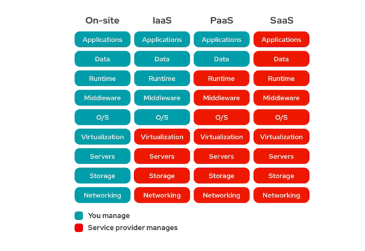

# Cloud-Service-Modelle: IaaS, PaaS, SaaS

## 1.Begriff und Bedeutung

IaaS, PaaS und SaaS sind gängige Cloud-Service-Modelle. Sie stellen IT-Dienste wie Infrastruktur, Plattformen oder Software über das Internet bereit. So können sich Unternehmen auf ihre Kernaufgaben konzentrieren, ohne sich um die zugrunde liegende Technik kümmern zu müssen.

**IaaS:** Infrastructure as a Service bezeichnet ein Modell, bei dem die grundlegende IT-Infrastruktur bereitgestellt wird. Dazu zählen Komponenten wie virtuelle Server, Speichersysteme und Netzwerklösungen. Die Nutzer behalten dabei die vollständige Kontrolle über das Betriebssystem, die Anwendungen sowie die darauf gespeicherten Daten.

**PaaS:** Platform as a Service erweitert diesen Ansatz, indem nicht nur die Infrastruktur, sondern auch eine komplette Entwicklungsumgebung zur Verfügung gestellt wird. Diese Plattform ermöglicht es, eigene Anwendungen zu erstellen, zu testen und bereitzustellen, ohne sich um den Betrieb der zugrunde liegenden Infrastruktur kümmern zu müssen. Viele Aufgaben wie Skalierung, Sicherheitsupdates oder Wartung übernimmt der Anbieter automatisch.

**SaaS:** Software as a Service stellt schließlich vollständig entwickelte und direkt nutzbare Softwarelösungen über das Internet bereit. Diese Anwendungen können unmittelbar im Webbrowser oder über eine App verwendet werden. Eine lokale Installation oder Wartung durch die Nutzer ist nicht erforderlich, da alle technischen Aspekte somit vom Anbieter übernommen werden.

Der Hauptunterschied zwischen IaaS, PaaS und SaaS liegt im Umfang der Verantwortung. Bei IaaS trägt der Nutzer viel Eigenverantwortung, bei SaaS übernimmt der Anbieter fast alles. PaaS liegt dazwischen und richtet sich vor allem an Entwickler, die Anwendungen erstellen, ohne die Plattform selbst verwalten zu müssen.

## 2.Anwendungsbereiche und Einsatzkontext

Infrastructure as a Service wird genutzt, wenn Unternehmen ihre Infrastruktur auslagern, aber dennoch Kontrolle über Betriebssysteme, Anwendungen und Daten behalten wollen. Typische Einsatzszenarien sind das Hosting von Webservern, Entwicklungs- oder Testumgebungen. Besonders Start-ups oder Firmen mit wechselndem Ressourcenbedarf profitieren von der flexiblen Skalierbarkeit virtueller Maschinen. Führende IaaS-Anbieter wie Amazon Web Services (AWS), Microsoft Azure und Google Cloud Platform bieten ein breites Spektrum an Diensten an, vom einfachen Hosting bis hin zu komplexen Cloud-Infrastrukturen.

Platform as a Service richtet sich an Entwickler, die sich auf die Programmierung konzentrieren möchten, ohne Infrastruktur selbst verwalten zu müssen. Technische Aufgaben wie Datenbankmanagement, Skalierung oder Sicherheitsupdates übernimmt der Anbieter. So können Anwendungen schneller entwickelt und bereitgestellt werden. Bekannte PaaS-Anbieter sind Google App Engine, Microsoft Azure App Services, IBM Cloud und Adobe Commerce im E-Commerce-Bereich. Sie bieten zahlreiche Tools und Schnittstellen zur Unterstützung des gesamten Entwicklungsprozesses.

Software as a Service (SaaS) stellt fertige Anwendungen bereit, die direkt im Browser genutzt werden können und dies ohne Installation oder Wartungsaufwand. Besonders verbreitet sind Tools für Kommunikation, Büroarbeit und Projektmanagement. Bekannte Beispiele sind Microsoft 365, Google Workspace, Slack, Trello, Zoom, Dropbox und HubSpot. Diese Dienste ermöglichen flexiblen Zugriff von überall und entlasten die IT, da Betrieb, Updates und Sicherheit vom Anbieter übernommen werden.

Durch die Kombination von IaaS, PaaS und SaaS lassen sich flexible, auf das Unternehmen zugeschnittene Hybridlösungen schaffen. So kann z. B. die Infrastruktur per IaaS bereitgestellt, die Entwicklung über PaaS erfolgen und das Endprodukt als SaaS genutzt werden.

## 3.Technische Grundlagen und Funktionsweise

IaaS, PaaS und SaaS nutzen jeweils unterschiedliche Ebenen der IT-Infrastruktur und bilden so verschiedene Schichten im Cloud-Computing. Alle basieren darauf, dass die Ressourcen übers Internet bereitgestellt werden. Dies geschieht meist mithilfe von Virtualisierung, Automatisierung, Containern und APIs.

Bei IaaS greifen Nutzer über Webportale oder APIs auf virtuelle Maschinen, Speicher und Netzwerke zu. Die Virtualisierung ersetzt physische Hardware durch flexible, dynamisch verwaltbare Instanzen. Ressourcen lassen sich in Echtzeit skalieren und nutzungsbasiert abrechnen. Zum Einsatz kommen häufig Hypervisoren wie KVM, VMware ESXi oder Hyper-V, die mehrere virtuelle Maschinen auf einem Server ermöglichen.

PaaS bietet eine fertige Laufzeitumgebung, in der Anwendungen automatisch bereitgestellt und verwaltet werden können. Es basiert oft auf Containern, integrierten Datenbankdiensten und Entwicklungsframeworks. Wichtige Konzepte sind CI/CD, mit denen neue Funktionen über automatisierte Pipelines schnell und sicher in Anwendungen integriert werden.

SaaS hingegen basiert auf dem Multitenancy-Prinzip: Viele Nutzer teilen sich eine Anwendung, ihre Daten bleiben jedoch getrennt. Der Anbieter übernimmt Betrieb, Updates, Sicherheit und Verfügbarkeit. SaaS-Anwendungen laufen meist im Browser, nutzen Webstandards wie HTTPS, REST oder SOAP und lassen sich oft per API in andere Systeme integrieren.

Ein technischer Vorteil von IaaS, PaaS und SaaS ist die automatisierte Ressourcenverwaltung. Über Orchestrierungsdienste und Self-Service-Portale können Unternehmen Dienste flexibel selbst buchen, anpassen oder deaktivieren und dies ganz ohne direkten Eingriff des Anbieters.

## 4.Gängige Protokolle

Bei IaaS werden häufig Protokolle wie SSH für die Fernverwaltung von Linux-Servern und RDP für Windows-Systeme verwendet. Für den Zugriff auf Speicher nutzt man unter anderem SFTP, NFS oder SMB. Viele Funktionen werden über REST-APIs angesteuert.

Im PaaS-Bereich läuft die Kommunikation in der Regel über HTTPS und REST-APIs, etwa für den Zugriff auf Datenbanken, Anwendungen oder Deployment-Prozesse. Auch gRPC wird teilweise für den Austausch zwischen Microservices genutzt.

SaaS-Anwendungen setzen meist auf HTTPS für den sicheren Zugriff über den Browser. Für Authentifizierung kommen Standards wie OAuth 2.0, SAML oder OpenID Connect zum Einsatz. APIs ermöglichen zusätzlich die Anbindung an andere Systeme.

## 5.Produkte

**IaaS:**  
– Amazon Web Services (AWS EC2)  
– Microsoft Azure Virtual Machines  
– Google Compute Engine  
→ Bieten virtualisierte Server, Netzwerke und Speicher, flexibel skalierbar.

**PaaS:**  
– Google App Engine  
– Microsoft Azure App Services  
– Heroku  
→ Stellen Entwicklungsumgebungen mit Frameworks, Datenbanken und CI/CD bereit.

**SaaS:**  
– Microsoft 365  
– Google Workspace  
– Dropbox  
– Zoom  
→ Webbasierte Anwendungen für Kommunikation, Zusammenarbeit, CRM und Datenmanagement

## 6.Tools

**IaaS:**  
– Terraform, Ansible  
– AWS CLI, Azure CLI  
→ Automatisierte Bereitstellung und Konfiguration, Kommandozeilenzugriff auf Ressourcen.

**PaaS:**  
– Git, Docker, Kubernetes  
– Jenkins, GitLab CI, GitHub Actions  
→ Entwicklung, Containerisierung und CI/CD für automatisierte Deployments.

**SaaS:**  
– APIs, Zapier, Make, Microsoft Power Automate  
– Admin-Portale, Web-Dashboards  
→ Integration von Diensten und zentrale Verwaltung über Web-Oberflächen.

## 7.Beispielhafte Architektur

Das folgende Diagramm zeigt, wie sich die Verantwortlichkeiten zwischen Nutzer und Anbieter in den Modellen On-Site/On-Premise, IaaS, PaaS und SaaS unterscheiden. Je weiter man sich in Richtung SaaS bewegt, desto mehr übernimmt der Cloud-Anbieter. Während bei On-Site alles selbst verwaltet wird, übernimmt bei SaaS der Anbieter so gut wie alle Aufgaben.

## 8.Fazit

IaaS, PaaS und SaaS machen es möglich, IT-Ressourcen flexibel und je nach Bedarf zu nutzen. Je mehr man an den Anbieter abgibt, desto weniger Aufwand hat man selbst, aber dafür auch weniger Kontrolle. Welches Modell am besten passt, hängt davon ab, was man braucht und wie viel man selbst verwalten will. In der Praxis werden die Modelle oft kombiniert, um möglichst effizient zu arbeiten.

## 9.Quellen:

<https://www.redhat.com/de/topics/cloud-computing/iaas-vs-paas-vs-saas>

<https://blog.hubspot.de/service/iaas-paas-saas>

<https://www.ionos.at/digitalguide/server/knowhow/iaas-paas-saas-unterschiede/>